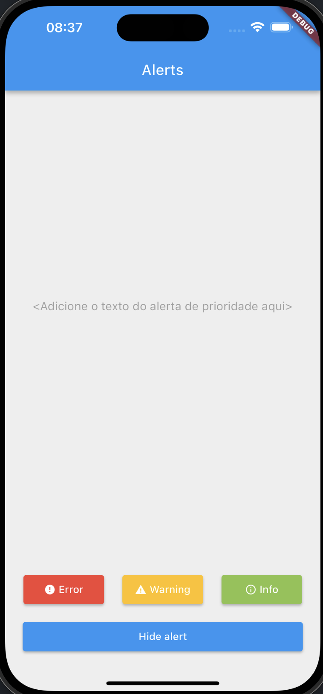
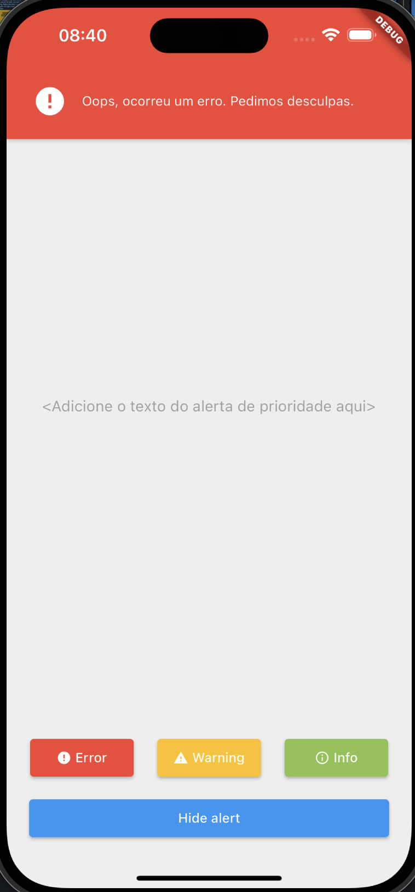
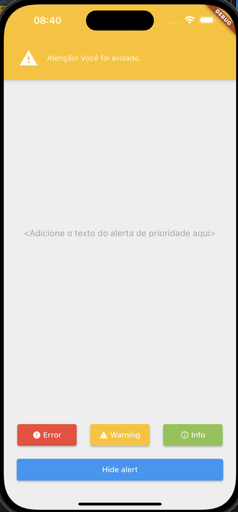
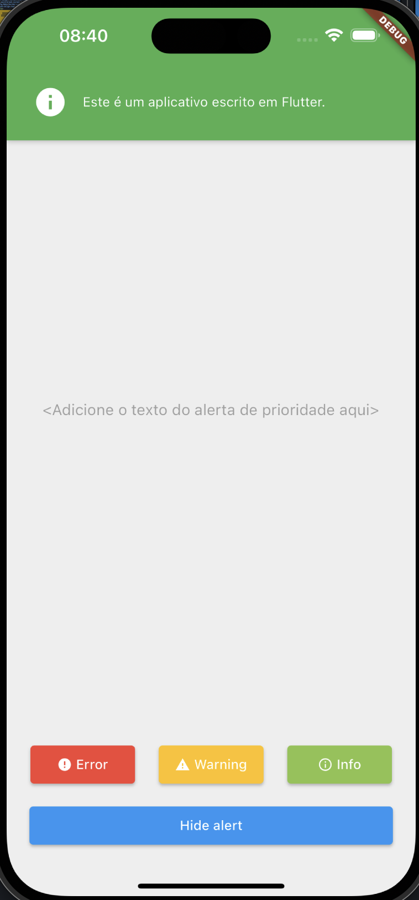

# Priority Alert App

O aplicativo de prioridades é um aplicativo simples que mostra alguns tipos de alertas quando clicamos nos botões no final da página. Para cada botão de prioridade, um alerta de cor é idêntica a do botão é apresentado na tela. Ainda, alertas podem ser limpados por meio do botão de esconder alertas.

As figuras abaixo ilustram o comportamento **atual** do aplicativo:
<br><br>
<table class="tg">
<thead>
  <tr>
    <th class="tg-0pky">Home</th>
    <th class="tg-0pky">Erro</th>
    <th class="tg-0pky">Aviso</th>
    <th class="tg-0pky">Informação</th>
  </tr>
</thead>
<tbody>
  <tr>
    <td class="tg-0pky">
        
    </td>
    <td class="tg-0pky">
        
    </td>
    <td class="tg-0pky">
        
    </td>
    <td class="tg-0pky">
        
    </td>
  </tr>
</tbody>
</table>

## O que você deverá fazer

Nesse desafio, você deve refatorar o aplicativo e adicionar alguns comportamentos adicionais, tais como:

1. Atualmente, o aplicativo não considera a prioridade dos alertas, logo, um alerta de erro pode ser sobrescrito por um alerta de informação, por exemplo. Isso deve ser alterado de modo que um alerta de erro tenha prioridade absoluta, seguido de um alerta de aviso e, por fim, com a menor prioridade, o alerta de informações. Em termos de código, você deve usar a `enum` preestabelecida abaixo:

```dart
enum AlertPriority {
  error(2),
  warning(1),
  info(0);

  const AlertPriority(this.value);
  final int value;
}
```

2. Atualmente, um alerta substituí o outro. Você deve alterar esse comportamento de modo que um alerta de prioridade mais alta sobreponha (fique em cima) de um alerta de prioridade mais baixa. O contrário, no entanto, não pode ser verdade, ou seja, um alerta de informação não pode aparecer sobre um alerta de aviso. Nessa última situação, o alerta de aviso deverá ficar no topo e o alerta de informação só aparecerá quando o botão de esconder o alerta atual for acionado.

3. Com esse novo comportamento de sobreposição, cada alerta deverá ter sua entrada e saída animada. A animação deve seguir a mesma configuração preestabilecida abaixo:

```dart
animation = Tween<double>(begin: -alertHeight, end: 0.0).animate(
      CurvedAnimation(parent: controller, curve: Curves.easeInOut),
    );
```

4. Por fim, você deve alterar a mensagem no centro da tela para que ela apresente o mesmo texto do alerta de maior prioridade que está sendo apresentado no momento.

## Como você deve fazer a entrega

Você pode fazer a entrega da solução de duas formas:

1. Enviar um e-mail anexando um arquivo zip contendo **somente** os arquivos `lib/main.dart` e `lib/alert_messenger.dart`.
2. Usar a plataforma https://zapp.run/ e compartilhar o link da solução final